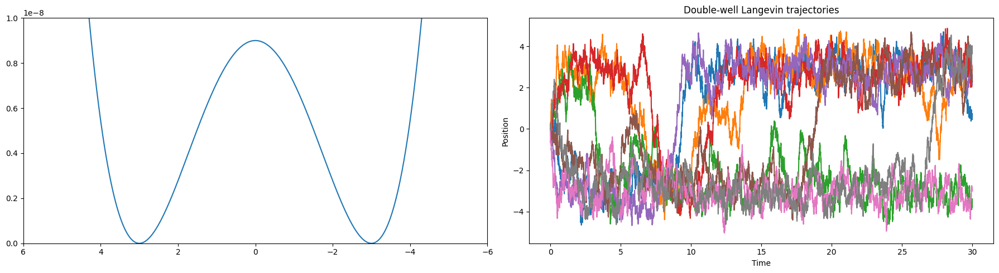
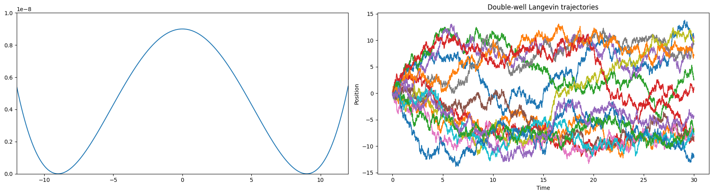
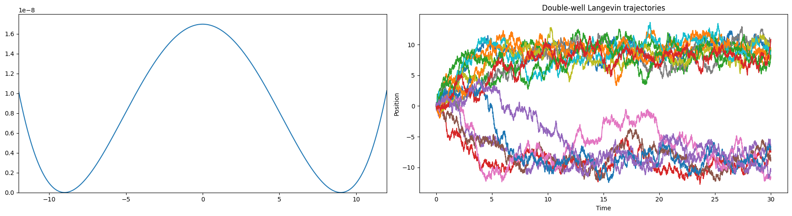

# synthetic_data_generator

Potential function $\rightarrow f(x)=h(\frac{(x-\mu)^4}{a^4} - \frac{2(x-\mu)^2}{a^2}) + c(x-\mu)$

Stochastic Simulation $\rightarrow x(t+\Delta t)=x(t) -\frac{\Delta f}{\Delta x}(x(t))\frac{\Delta t}{\zeta} + F_r$

$\frac{\Delta f}{\Delta x} \approx \frac{df}{dx} = h(\frac{4((x - \mu)^3)}{(a^4)} - \frac{4(x - \mu)}{a^2}) +c$

$$K_B= 1.38 \times 10^{-11} \frac{kg \times \mu m^2}{s^2}$$

$$T = 300K$$

$$t_0 = 0 s$$

$$total \\ time = 30 sec$$

barrier $\approx 2K_BT $ 

barrier $\approx 4K_BT $ 

Use programmatically (see demo.py and generators.py) 

or run the bash script with the appropriate parameters and have the data saved as in a .csv file

 example usage:
./sw_script.sh 30 4e-3 0 2.3e-9 2.26e-9 0 300 1.38e-11 5 cpu

